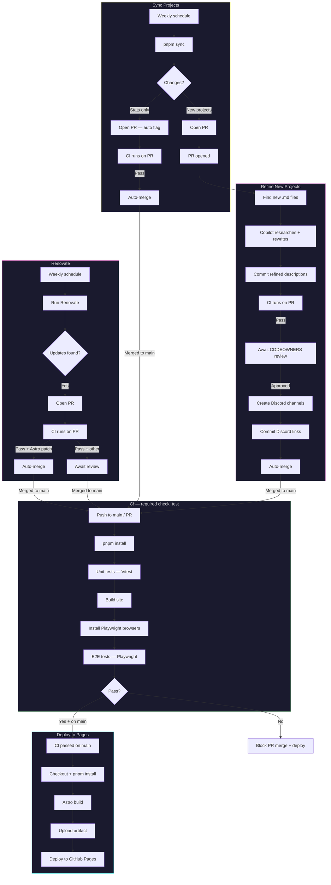

# CI/CD Workflows

## Overview

Five workflows automate testing, deployment, dependency management, and content sync for tjw.dev.

## Workflows

### CI (`ci.yml`)

Runs unit tests (Vitest) and e2e tests (Playwright) on every PR and push to `main`. The `test` job is a required status check — no PR can merge to `main` without it passing.

**Trigger:** PR to `main`, push to `main`, manual dispatch
**Secrets:** None (uses `GITHUB_TOKEN`)

### Deploy to Pages (`deploy-on-push.yml`)

Builds the Astro site and deploys to GitHub Pages. Triggered by CI completing on `main` — skips deploy if CI failed.

**Trigger:** CI workflow completes on `main`, manual dispatch
**Secrets:** None (uses `GITHUB_TOKEN`)

### Renovate (`renovate.yml`)

Runs Renovate to keep dependencies up to date. Opens PRs with grouped updates and flags security vulnerabilities. PRs must pass CI (`test` required check) before merge. Astro patches auto-merge once CI passes.

**Trigger:** Weekly (Tuesday 6am EST), push to config files, manual dispatch
**Secrets:** `RENOVATE_TOKEN` (PAT with repo + workflow scopes)

### Sync Projects (`sync-projects.yml`)

Fetches GitHub repos and generates project content files. Opens two types of PRs:
- **Stats-only PR** (stars, downloads, activity) — uses `--auto` flag, merges after CI passes
- **New projects PR** — requires CI + CODEOWNERS review before merge

**Trigger:** Weekly (Monday 9am UTC), manual dispatch
**Secrets:** `DISCORD_TOKEN`, `DISCORD_SERVER`

### Refine New Projects (`refine-projects.yml`)

Two-phase workflow triggered by the new projects PR from sync:

1. **Phase 1 (PR opened):** Copilot CLI researches each new project and rewrites descriptions, downloads hero images, validates links
2. **Phase 2 (PR approved):** Creates Discord channels for each project, commits links, then auto-merges the PR

**Trigger:** PR opened or approved on `auto/sync-projects` branch
**Secrets:** `COPILOT_PAT`, `DISCORD_TOKEN`, `DISCORD_SERVER`, `DISCORD_CATEGORY`

## Required Secrets

| Secret | Type | Scopes | Used By |
|---|---|---|---|
| `RENOVATE_TOKEN` | Fine-grained PAT | Contents R/W, PRs R/W, Workflows R/W | Renovate |
| `COPILOT_PAT` | Classic PAT | `copilot` | Refine Projects |
| `DISCORD_TOKEN` | Discord bot token | Manage Channels | Sync, Refine |
| `DISCORD_SERVER` | Discord guild ID | — | Sync, Refine |
| `DISCORD_CATEGORY` | Discord category ID | — | Refine |

## Required Repo Settings

- **Pages source:** GitHub Actions
- **Actions permissions:** Read & write, allow PR creation
- **Branch protection on `main`:**
  - Require status checks to pass: `test` (from CI workflow)
  - Require pull request before merging (enables CODEOWNERS enforcement)
  - Require review from Code Owners
- **Labels:** `automated`, `content`, `security`
- **CODEOWNERS:** `src/content/projects/` and `public/projects/` require review

## Flow

